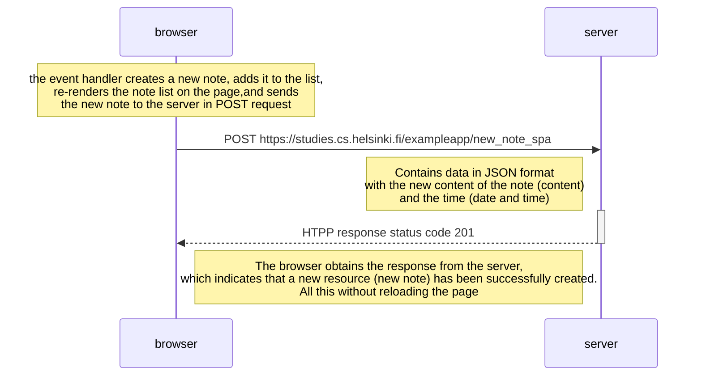

```mermaid
sequenceDiagram
    participant browser
    participant server

    Note over browser: the event handler creates a new note, adds it to the list, <br> re-renders the note list on the page,and sends <br>the new note to the server in POST request

    browser->>server: POST https://studies.cs.helsinki.fi/exampleapp/new_note_spa
    Note left of server: Contains data in JSON format <br>with the new content of the note (content) <br>and the time (date and time)
    activate server
    server-->>browser: HTPP response status code 201
    deactivate server
    Note right of browser: The browser obtains the response from the server,<br> which indicates that a new resource (new note) has been successfully created. <br>All this without reloading the page
```