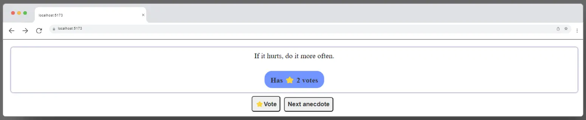

# Anecdotes - step 1

In this step of the exercise, **_we implement a button to vote for the anecdote show on the screen:_**
[**👉go to anecdotes: _App.jsx_**](./src/App.jsx)



## App specifications

This web app shows anecdotes from Software engineers.

When you click the Next anecdote button, the app does the following:

- **User anecdotes are shown randomly.**

When you click the Vote button, the app does the following:

- **The vote counter for the anecdote displayed on the screen increases by one.**

## Installation

Install the libraries needed with npm command:

```bash
  npm install
```

Then start the app with the command.

```bash
  npm run dev
```
