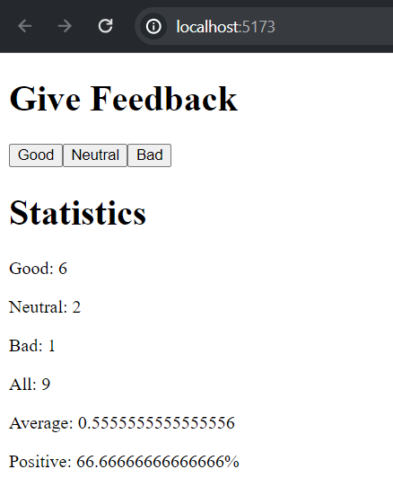

# Unicafe - step 2

In this step of the exercise, ***we extended the app to show more statistics about the gathered feedback: the total number of collected feedback, the average score (good: 1, neutral: 0, bad: -1) and the percentage of positive feedback.***.


## Installation

Install the libraries needed with npm command:
```bash
  npm install 
```
Then start the app with the command.
```bash
  npm run dev
```