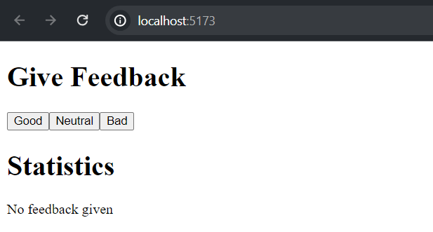

# Unicafe - step 5

In this step of the exercise, ***we refactored the app to extract the following 2 components:***
* **Button handles the functionality of each feedback submission button.**
* **StatisticLine for displaying a single statistic, e.g. the average score.**


## Installation

Install the libraries needed with npm command:
```bash
  npm install 
```
Then start the app with the command.
```bash
  npm run dev
```