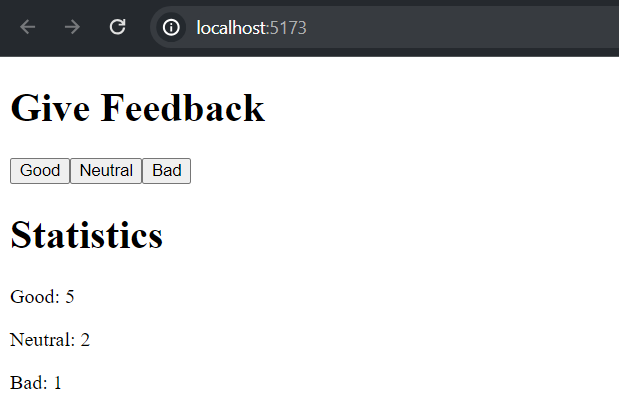

# Unicafe - step 1

In this step of the exercise, we ***implemented a web app to collect customer feedback***. There **are only three options for comments: good, neutral and bad.**


## Installation

Install the libraries needed with npm command:
```bash
  npm install 
```
Then start the app with the command.
```bash
  npm run dev
```