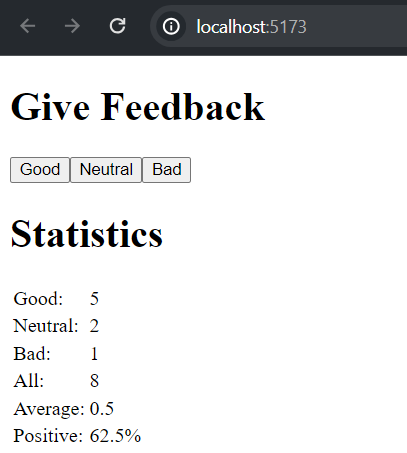

# Unicafe - step 6

In this step of the exercise, ***we refactored the app to display the statistics in an HTML table:***
[**👉go to Unicafe: _App.jsx_**](./src/App.jsx)


## App specifications
This web app collects customers feedback. There are only three options for feedback: good, neutral and bad.

When collecting feedback, the app displays the following statistics:
* **The number of feedbacks collected for each option(good, neutral, bad).**
* **The total number of feedbacks collected (*all*)**.
* **The average score (*good*:1, *neutral*:0 , *bad*:-1).**
* **The porcentage of *positive feedback*.**

## Installation

Install the libraries needed with npm command:
```bash
  npm install 
```
Then start the app with the command.
```bash
  npm run dev
```