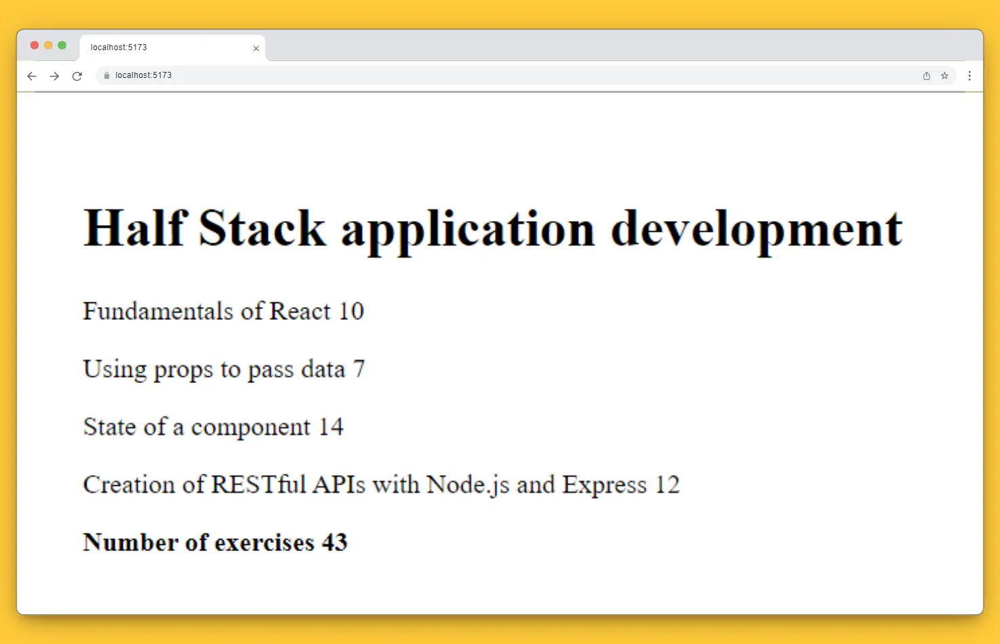

# Course Information - step 6 - 8

In this step of the exercise, ***We refactored the structure of the components to format the information of a single course in a component called Course, that way, the Course component is responsible for rendering the name and parts of the course. And calculate the total exercises using the array method <u>reduce</u>***



## Task completed
- [x] step 6
- [x] step 7
- [x] step 8
## Installation

Install the libraries needed with npm command:
```bash
  npm install 
```
Then start the app with the command.
```bash
  npm run dev
```