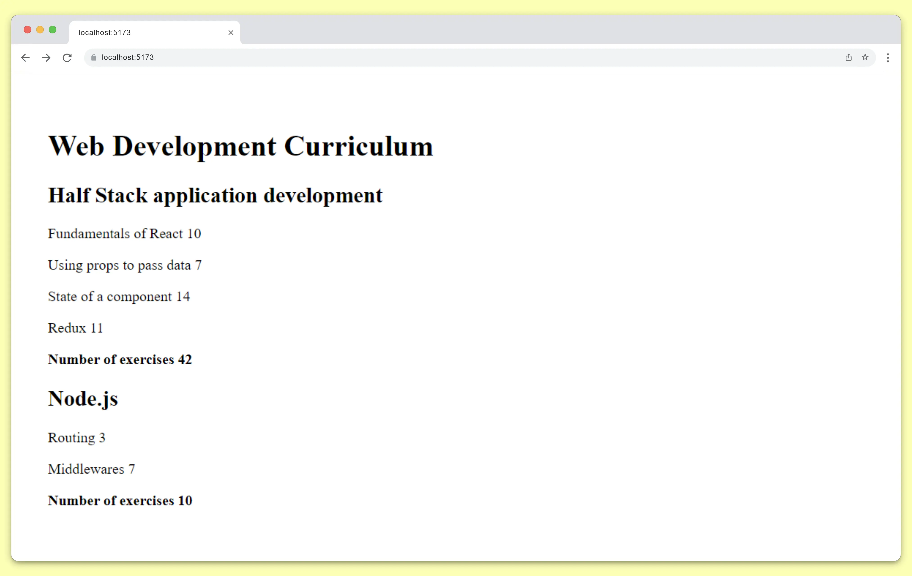

# Course Information _ step 9 - 10

In this step of the exercise, ***we extend the app to allow an arbitrary number of courses and separate the Course component and its subcomponents into a separate module that is imported into the App component.***



## Task completed
- [x] step 9 (Allow an arbitrary number of courses).
- [x] step 10 (Separate the Course component and its subcomponents into a separate module).

## Installation

Install the libraries needed with npm command:
```bash
  npm install 
```
Then start the app with the command.
```bash
  npm run dev
```